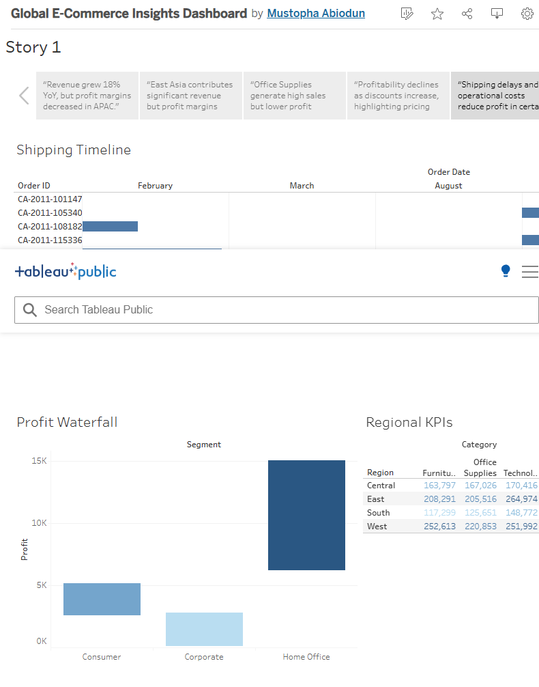
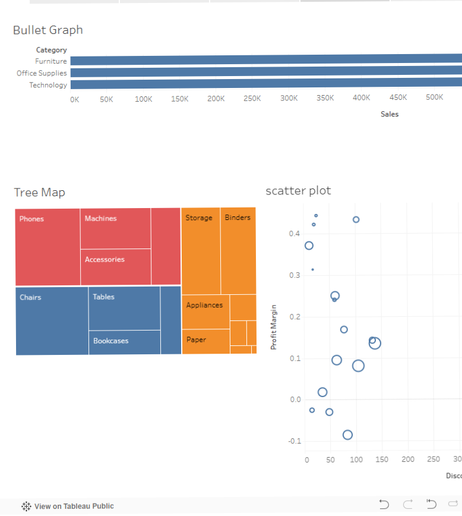
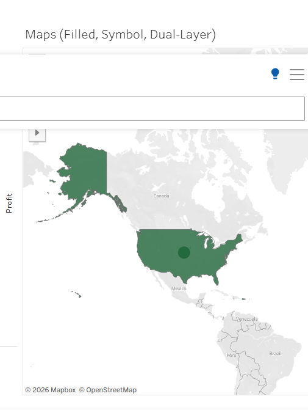
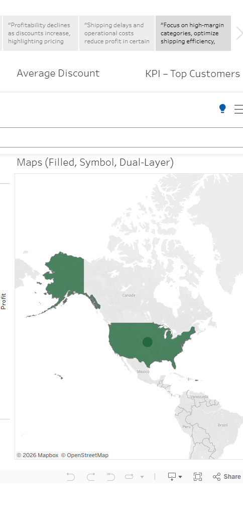

# 📊 Global E-Commerce Insights Dashboard (Tableau)

## 📌 Project Overview
This project analyzes global e-commerce performance using Tableau to uncover insights on sales, profit, customer behavior, and operational efficiency.

---

## 🎯 Objectives
- Identify high and low-performing regions
- Analyze product and category profitability
- Understand customer revenue contribution
- Evaluate impact of discount strategies
- Monitor trends over time

---

## 🧰 Tools & Techniques
- Tableau
- LOD Expressions (FIXED, INCLUDE, EXCLUDE)
- Table Calculations (Running Total, YoY Growth, Moving Average)
- Parameters (Top N, Metric Selector, Discount Threshold)
- Dashboard Actions (Filter, Highlight)

---

## 📊 Dashboards

### 1️⃣ Executive Overview
- KPI metrics (Sales, Profit, Margin, Growth)
- Geo-spatial performance analysis
- Time series trends

---

### 2️⃣ Product & Category Analysis
- Top N products
- Tree map and heatmap analysis
- Discount impact insights

---

### 3️⃣ Operations & Customer Insights
- Shipping duration (Gantt chart)
- Profit contribution (Waterfall chart)
- Customer revenue distribution

---

## 📖 Story Insights

- Revenue growth observed, but profit margins vary across regions  
- Certain categories generate high sales but low profit  
- Top customers contribute a large share of revenue  
- Shipping delays negatively impact profitability  

---

## 💡 Key Insights

- High sales regions do not always yield high profit  
- Discount strategy significantly affects margins  
- Revenue is concentrated among a small group of customers  
- Operational inefficiencies impact overall performance  

---

## 🚀 Recommendations

- Optimize discount strategies in low-margin regions  
- Focus on high-value customer segments  
- Improve logistics to reduce shipping delays  

---

## 🔗 View Interactive Dashboard
👉 [https://public.tableau.com/app/profile/mustopha.abiodun/viz/session11-15/Story1]
